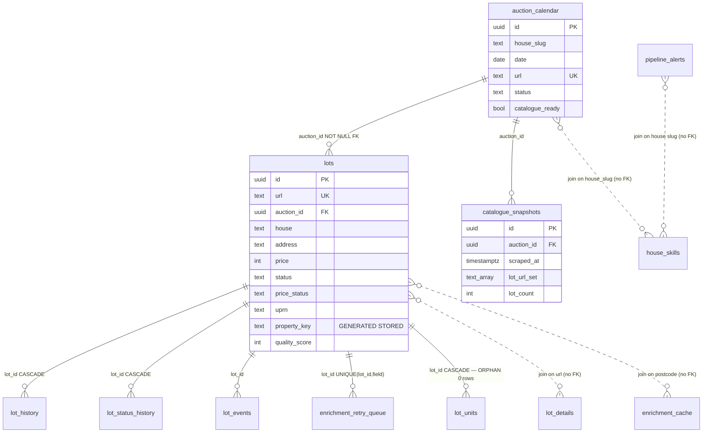

# AuctionBrain — Data Integrity & Schema Audit

- **Date:** 2026-05-25
- **Supabase project:** `Auction.Bridgematch` (`pohrbfhftbprlfzsozyj`, eu-west-2, Postgres 17)
- **Scope:** lot data, unified lot identifier, per-house data quality
- **Mode:** diagnostic only — no code, no migrations, no refactors
- **Out of scope (parallel audit):** Firecrawl spend, Puppeteer migration candidates

---

## 1. Scraping architecture map (data flow only)

All lot writes flow through a single funnel: **`lib/pipeline/persist-lots.js :: upsertToLotsTable(enrichedLots, house, catalogueUrl, metadata)`**. Every entry point below ultimately calls this function. There is no second writer to the `lots` table that bypasses it for the price/status/identity fields.

The conflict key on the upsert is **`url` ALONE** (not `(house, url)`) — set by the 2026-05-07 cross-house dedup migration.

### 1.1 Cron-driven (built into the Node process — single server, role-gated)

`server.js` runs an `setInterval(scheduleTick, 60000)` cron driver. `ROLE=web` disables it; `ROLE=worker` or unset enables it. There are **18 tiers** (Tier 1 → Tier 18):

| Tier | When (UK time) | Job | Houses covered | Write target |
|---|---|---|---|---|
| 0 (boot) | T+60s on startup | `autoAnalyseAll()` if last scrape >25h ago, else free enrichment | All `HOUSE_ROOTS` | `lots` (via upsertToLotsTable) |
| 1 | 03:00 daily | `watchAuctionCalendar() → syncCalendar() → autoAnalyseAll()` | All `HOUSE_ROOTS` (~173 slugs, currently 168 in `house_skills`) | `lots`, `lot_history`, `lot_status_history`, `lot_events`, `catalogue_snapshots`, `auction_calendar` |
| 2 | every 30 min | `runEnrichmentWave({freeOnly:true, drainRetries:false})` | Lots with missing free enrichment fields | `lots.update(...)` (per-field), `enrichment_cache` |
| 3 | hourly 09:00–18:00 | `statusDriftTick()` — samples 10 upcoming-auction lots from one round-robin house | One house per tick | `lots.update(status)`, `lot_status_history`, `house_skills.last_drift_checked_at` |
| 4 | 04:00 daily | `drainStaleRentals({limit:50})` | Active-auction postcodes | `postcode_rentals`, `postcode_rental_freshness` |
| 5 | 03:05 + 13:00 daily | `drainHygieneRetries()` | Lots in `enrichment_retry_queue` | `lots.update`, `enrichment_retry_queue` |
| 6 | 05:00 daily | `sweepPostAuctionStatuses()` — re-fetch detail page for lots 1–30 days past auction | All houses, lots with stuck `available`/`unsold` status | `lots.update(status, sold_price)`, `lot_status_history`, `lot_events` |
| 7 | 06:00 daily | `sweepMultiImages()` — fill image galleries | Active lots with `<3` images (50/day, 14-day cooldown) | `lots.update(image_url, images?)` |
| 8 | 7th of month, 02:00 | HMLR refresh (HPI + CCOD + OCOD + PPD) — spawns child Node processes | n/a (reference data) | `hmlr_hpi`, `hmlr_corporate_owners`, `hmlr_ppd` |
| 9 | 02:30 daily | `sweepStaleAlerts()` | n/a | `pipeline_alerts.update(resolved)` |
| 10 | 09:00 daily | `buildCoverageDigest()` + Telegram | Reads only | `coverage_snapshots` |
| 11 | 04:30 daily | `regenerateSitemap()` | Active lots | `public/sitemap.xml` (file, not DB) |
| 12 | 03:30 every other day | `runHomepageWatchCycle()` — Firecrawl every homepage, detect URL drift, optionally `healBrokenHouse()` | All `HOUSE_ROOTS` | `house_homepage_watch`, `auction_calendar`, `pipeline_alerts` |
| 13 | 08:00 daily | `runSavedSearchAlertsCycle()` | Reads only | `saved_searches.last_notified_at` |
| 14 | Monday 09:00 | `runWeeklyDigestCycle()` | Reads only | `email_signups.last_digest_at` |
| 15 | 02:45 daily | `runPhantomLotSweep()` — flips `extraction_failure` on lots that fail `looksLikeRealAddress()` | Active lots last seen ≤30d | `lots.update(status='extraction_failure')` |
| 16 | 05:30 daily | `runCuratorCycle()` — Gemini Pro picks top 8 lots, marks `pending` | Reads `lots` | `curator_picks` |
| 17 | 12:00 daily | `runDailyDigestCycle()` — emails approved curator picks | Reads only | `email_signups.last_daily_at` |
| 18 | 20:00 daily | `sweepSameDayStatuses()` — re-fetch today's auctions | Today's `available`/`unsold` lots | `lots.update(status, sold_price)`, `lot_status_history`, `lot_events` |

`scheduleTick()` is a single, in-process timer. There is **no Railway cron, no Supabase pg_cron, no GitHub Action** writing to `lots` — confirmed by absence of `.github/workflows/` and by `migrations/` containing no `cron.schedule(...)`.

### 1.2 API routes that write lot data

| Endpoint | Auth | What it writes | Target |
|---|---|---|---|
| `POST /api/analyse` (`routes/analyse.js:35`) | user-session (with admin bypass via `X-Admin-Secret`) | Single-catalogue scrape on demand. Scrape → enrich → score → `upsertToLotsTable()`. | `lots`, `lot_history`, `lot_status_history`, `catalogue_snapshots`, `cached_analyses` |
| `POST /api/admin/backfill-images` (`routes/admin.js:99`) | `requireAdmin` | Re-runs image extraction across a house's cached lots → `upsertToLotsTable(scrapedWith:'image-backfill')` | `lots` (image_url only, via merge-safe upsert) |
| `POST /api/admin/rescrape` (`routes/admin.js:285`) | `requireAdmin` | Bypasses cache; runs `autoAnalyseOne()` for one house | Same as Tier 1 but for one house |
| `POST /api/admin/run-watcher` (`routes/admin.js:830`) | `requireAdmin` | Runs `watchAuctionCalendar()` | `auction_calendar`, `pipeline_alerts` |
| `POST /api/admin/re-enrich` (`routes/admin.js:1098`) | `requireAdmin` | Re-runs enrichment for a slug-scoped set; ends in `upsertToLotsTable(scrapedWith:'re-enrich')` | `lots` (merge-safe) |
| `POST /api/admin/enrich-waves` (`routes/admin.js:1179`) | `requireAdmin` | Triggers `runEnrichmentWave()` (paid-enrichment unlocked) | `lots.update(...)`, `enrichment_cache` |
| `POST /api/admin/seed-snapshot` (`routes/admin.js:1088`) | `requireAdmin` | Manually writes a `catalogue_snapshots` row (for first-time prune-from-snapshot bootstrapping) | `catalogue_snapshots` |
| `POST /api/admin/rentals/drain` (`routes/admin.js:1758`) | `requireAdmin` | Manual `drainStaleRentals()` | `postcode_rentals`, `postcode_rental_freshness` |
| `POST /api/admin/clear-cache` (`routes/admin.js:253`) | `requireAdmin` | Deletes `cached_analyses` rows | `cached_analyses` |
| `POST /api/admin/alerts/cleanup` (`routes/admin.js:1592`) | `requireAdmin` | Resolves alerts | `pipeline_alerts` |
| `POST /api/calendar/*` (`routes/calendar.js`) | `requireAdmin` | CRUD on `auction_calendar` | `auction_calendar` |
| `POST /api/curator/*` (`routes/curator.js`) | `requireAdmin` | Approve/reject curator picks | `curator_picks` |

### 1.3 Manual / one-shot scripts (operator-run, not scheduled)

| Script | Purpose | Writes to | Status |
|---|---|---|---|
| `scripts/backfill-auction-id.mjs` | Backfill `lots.auction_id` from `auction_calendar` URL match | `lots.update(auction_id)` | One-shot — already run; `auction_id` is now NOT NULL |
| `scripts/backfill-latlng.cjs` | Backfill `lat`/`lng` from postcodes.io | `lots.update(lat, lng)` | Idempotent — still useful |
| `scripts/backfill-postcodes-io.mjs` | Same family | `lots.update(...)` | Idempotent |
| `scripts/backfill-value-estimates.mjs` | Backfill `value_estimate` JSONB | `lots.update(value_estimate)` | Idempotent |
| `scripts/backfill-cdn-example-images.mjs` | Force-fill stale image URLs | `lots.update(image_url)` | Idempotent |
| `scripts/refresh-hmlr-hpi.mjs` / `refresh-hmlr-companies.mjs` / `refresh-hmlr-ppd.mjs` | Bulk HMLR load (also called by Tier 8 cron) | `hmlr_*` tables | Live |
| `scripts/diagnose-auction-id-gap.mjs` | Diagnostic only — no writes | n/a | Diagnostic |
| `scripts/discover-houses-search.mjs` / `discover-houses.mjs` | Manual house discovery | `discovery_candidates` | Live |
| `scripts/regenerate-sitemap.mjs` | Sitemap regen (also called by Tier 11 cron) | File only | Live |
| `scripts/probe-*.mjs` (4 files) | Diagnostic only | n/a | Diagnostic |
| `scripts/audit.mjs` | Per-house health snapshot | `house_skills`, `analytics_snapshots` | Live (nightly cron-callable but not currently in scheduleTick) |
| `scripts/rescrape-ex-dom-houses.sh` | Curl loop calling `/api/admin/rescrape` | Via admin route | Manual |
| `scripts/visual-audit.mjs` | Puppeteer screenshot diff | `lots.update(visual_audit_*)` | Manual |
| `scripts/setup_auction.py` | Initial bootstrap | n/a | Stale (Python, not JS) |
| `scripts/count-lots.py` | Diagnostic only | n/a | Diagnostic |
| `scripts/output/` | Output artefacts | n/a | n/a |

### 1.4 Redundant write paths (flagged for review)

1. **`sweepPostAuctionStatuses` (Tier 6, 05:00) + `sweepSameDayStatuses` (Tier 18, 20:00) + `statusDriftTick` (Tier 3, hourly 09–18)** all flip `lots.status` from `available` to a terminal status by re-fetching the detail page. The cohorts differ (Tier 18 = today; Tier 6 = 1–30 days past; Tier 3 = next 7 days, still pre-auction), so they are complementary rather than duplicate — but **Tier 3 and Tier 18 can both fire on the same lot on auction day** (Tier 3 morning sample + Tier 18 evening), producing two `lot_status_history` rows + two `lot_events`. The cap is "1 per status transition" so the duplicates are real only when the source's status display flips twice in one day. Low risk, but worth noting.

2. **`upsertToLotsTable` is invoked from six call sites** with five distinct `scrapedWith` tags: `(direct scrape)`, `image-backfill`, `re-enrich`, `hygiene-enrich`, `hygiene-epc-backfill`, plus cache-warm. Same merge-safe code, but the **6th path — `lib/pipeline/cache-enrich-stage.js`** — writes lots even when `needsUpdate=false` is fresh; need to verify it isn't double-writing on every full pass. (Logged in Section 5 as a soft finding.)

3. **`lib/pipeline/enrichment-wave.js` has 6 direct `lots.update(...)` call sites** (lines 124, 342, 399, 448, 574, 599) that bypass `upsertToLotsTable`. They patch individual enrichment fields (EPC, OS Places, rent comps) on a single lot. This is intentional — `upsertToLotsTable` is designed for a catalogue batch, not a per-lot enrichment refresh — but it means **the merge-safety, snapshot, prune, and lot_events logic do not run** for these writes. Per-field stamps are correct; lifecycle observability is partial. Logged in Section 5.

4. **`lib/pipeline/multi-image-sweep.js:228` and `same-day-sweep.js:121,133,142`** also write directly via `lots.update(...)`. Same caveat as #3.

5. **`scripts/backfill-value-estimates.mjs:137`** does direct `lots.update` (single column) — fine as a one-shot.

### 1.5 Dormant / commented-out paths

- **DOM extractors retired 2026-05-08** — `lib/extractors/` was deleted. Architecture doc (`docs/ARCHITECTURE.md`) still references `lib/extractors/houses/` (line 67) and `DOM_EXTRACTORS` registry. **Doc is stale.** (Section 5.)
- **`server.js.txt`** — a 28k file in the repo root. Looks like a snapshot of the pre-split monolith. Not imported anywhere. (Section 5.)
- **`setup_auction.py`** — Python bootstrap script in root. Not referenced from package.json scripts or any other file. Likely dormant. (Section 5.)
- **`auction_houses` table** in Supabase — 0 rows, no writers in code. Orphan. (Section 5.)
- **`leads`, `payments`, `saved_searches`, `unsold_alerts`, `manager_cycles`, `lot_units`, `os_places_cache`, `authors`, `editor_state`, `user_deal_scenarios`, `curator_picks`** — all 0 rows. Schema present, writers present in some cases, no live traffic.

---

## 2. Supabase schema

Project: `Auction.Bridgematch` (`pohrbfhftbprlfzsozyj`), Postgres 17, eu-west-2. All counts as of 2026-05-25 16:00 UTC.

### 2.1 Core lot tables

#### `lots` — 16,725 rows · latest write 2026-05-25 15:55 · **LIVE**
Single source of truth for individual auction lots. Identity tuple: `id` (UUID PK), `url` (UNIQUE), `auction_id` (NOT NULL FK → auction_calendar).

| Column | Type | Constraints | Description |
|---|---|---|---|
| id | uuid | PK, default gen_random_uuid() | Surrogate PK |
| house | text | NOT NULL | Canonical house slug (lowercase) |
| lot_number | text |  | Auctioneer's lot number (string — some are alphanumeric) |
| url | text | UNIQUE | Detail-page URL. Synthetic placeholder `__synthetic__{house}__{addr}__{price}` when source has no detail URL |
| catalogue_url | text |  | Parent catalogue URL (normalised) — legacy join key, now supplemented by auction_id |
| auction_id | uuid | NOT NULL, FK→auction_calendar(id) ON DELETE SET NULL | Unified parent identifier (Move 2) |
| address | text |  | Property address; persist guard rejects rows with addr.length < 5 |
| postcode | text |  | UK postcode |
| price | int |  | Guide price in GBP, NULL when POA/TBA |
| price_text | text |  | Source's verbatim price string ("£75,000+", "POA", "TBA") |
| price_status | text |  | Derived: guide \| poa \| tba \| starting_bid \| sold \| withdrawn \| unknown |
| prop_type | text |  | "Terraced", "Flat", "Land" etc. |
| beds | int |  |  |
| tenure | text |  | Freehold/Leasehold |
| lease_length | int |  | Years remaining |
| sqft | int |  | Floor area |
| condition | text |  | Surveyor / extractor-inferred |
| image_url | text |  | Hero image; hero-bleed guard strips when ≥3 lots share same URL |
| floor_plan_url | text |  | Floor plan; self-URL guard strips when ==url |
| images | jsonb |  | **Unused in production** — schema present, never written by `upsertToLotsTable` (gated until gallery UI ships, per `COVERAGE_FIX_PLAN.md` fix #5) |
| bullets | jsonb | default [] | Auctioneer bullet points |
| units | int | default 0 | Number of distinct postal addresses in a portfolio lot |
| auction_date | date |  | Per-lot date (bullet > catalogue fallback) |
| status | text | default 'available' | available \| sold \| unsold \| withdrawn \| stc \| extraction_failure |
| sold_price | int |  | Hammer price when status=sold |
| epc_rating | text |  | A–G letter |
| epc_score | int |  | Numeric EPC |
| epc_date | date |  | Certificate date |
| epc_floor_area_sqm | float |  | From EPC API |
| epc_floor_area_sqft | int |  | Derived |
| epc_works_cost_mid | int |  | Recommended works cost (midpoint) |
| epc_works_summary | jsonb |  | Short-code array of recommended improvements |
| flood_zone | int |  | 1–3 |
| flood_risk | text |  | Low/Medium/High |
| street_avg | int |  | LR street-average sold price |
| street_sales | jsonb |  | Recent LR sales array |
| street_sales_count | int |  |  |
| below_market | int |  | % below market |
| est_monthly_rent | int |  | From `postcode_rentals` comps |
| est_annual_rent | int |  |  |
| est_gross_yield | numeric |  | (est_annual_rent / price) * 100 |
| value_estimate | jsonb |  | Methodology + low/mid/high (rollout #10) |
| score | numeric |  | analyseLot output (0–10) |
| score_breakdown | jsonb | default [] | Per-signal score contributors |
| opps | jsonb | default [] | Opportunity tags |
| risks | jsonb | default [] | Risk tags |
| deal_type | text |  | flip/btl/development/hmo etc. |
| vacant | bool |  |  |
| title_split | bool |  | Title-splitting opportunity |
| raw_text | text |  | Source text snippet |
| search_text | text |  | Concatenated NL blob (≤4000 chars) for FTS |
| search_vector | tsvector |  | Generated column — `to_tsvector('english', search_text)` |
| extracted_with | text |  | 'firecrawl-json' \| 'gemini' \| 'allsop-api' |
| scraped_with | text |  | 'firecrawl' \| 'puppeteer' \| 'http' \| 'image-backfill' \| 're-enrich' \| 'hygiene-enrich' etc. |
| first_seen_at | timestamptz | default now() | Never overwritten on upsert |
| last_seen_at | timestamptz | default now() | Always overwritten |
| enriched_at | timestamptz |  | Last successful enrichment pass |
| lat | numeric(9,6) |  | OS Places > postcodes.io fallback |
| lng | numeric(9,6) |  |  |
| enrichment_manifest | jsonb | default {} | Per-scrape outcome tags (always overwritten) |
| field_sources | jsonb | default {} | Per-field provenance (`setField()` only — sparse) |
| uprn | text |  | OS Places UPRN — stable property identifier |
| os_classification | text |  | OS classification code (RD/CR/CI etc.) |
| property_key | text | GENERATED ALWAYS STORED | `lower(coalesce(postcode,'')) \|\| '\|' \|\| lower(split_part(coalesce(address,''),',',1))`. 100% populated. Stable across re-scrapes; see Section 3. |
| quality_score | int |  | 0–100 (rollout #4) |
| quality_issues | jsonb | default [] | Short-code issues array |

#### `lot_history` — 11,996 rows · latest 2026-05-25 10:31 · **LIVE**
Append-only snapshot per (lot, scrape) when `snapshot_hash` differs. Drives time-on-market analytics + price-drop alerts.

| Column | Type | Notes |
|---|---|---|
| id | bigserial | PK |
| lot_id | uuid | FK→lots(id) ON DELETE CASCADE |
| scraped_at | timestamptz | default now() |
| price | int | At time of snapshot |
| price_text | text |  |
| status | text |  |
| sold_price | int |  |
| bullets_count | int |  |
| image_count | int |  |
| snapshot_hash | text | sha1(price\|status\|sold\|bullets_count\|image_count) — 16 char hex |

#### `lot_status_history` — 37,567 rows · latest 2026-05-25 07:28 · **LIVE**
One row per status transition. Pre-dates `lot_events`; both written during consumer migration.

| Column | Type | Notes |
|---|---|---|
| id | uuid | PK |
| lot_id | uuid | FK→lots(id) ON DELETE CASCADE |
| old_status | text |  |
| new_status | text | NOT NULL |
| changed_at | timestamptz | default now() |
| source | text | 'scrape' \| 'prune' \| 'sweep' etc. |

#### `lot_events` — 3,014 rows · latest 2026-05-25 10:31 · **LIVE**
Append-only event stream. Per-field events: `lot_status_changed`, `lot_price_changed`, `lot_sold_price_set`, `lot_price_status_changed`, `lot_vanished`, `lot_first_seen`. Co-exists with `lot_history`/`lot_status_history` during migration (migration 2026-05-19-lot-events.sql).

| Column | Type | Notes |
|---|---|---|
| id | bigserial | PK |
| lot_id | uuid | NOT NULL, FK→lots(id) |
| event_type | text | NOT NULL |
| old_value | jsonb |  |
| new_value | jsonb |  |
| detected_at | timestamptz | default now() |
| source | jsonb | NOT NULL — `{scrape_id, scraper_version, house, writer}` |

#### `lot_details` — 12,583 rows · latest 2026-05-25 07:27 · **LIVE**
30-day TTL HTML cache for detail-page fetches.

| Column | Type | Notes |
|---|---|---|
| url | text | PK |
| house | text | NOT NULL |
| html | text |  |
| html_hash | text |  |
| extracted_data | jsonb |  |
| source | text | 'firecrawl' \| 'puppeteer' \| 'http' |
| fetched_at | timestamptz | default now() |
| expires_at | timestamptz | default now()+30d |

#### `lot_units` — **0 rows** · never written · **ORPHAN (schema present, unused)**
Designed for per-postal-address children of portfolio/multi-property lots. Migration `2026-04-30-lot-units-schema.sql` shipped; no writer in code. Architecture doc still describes the feature.

| Column | Type | Notes |
|---|---|---|
| id | uuid | PK |
| lot_id | uuid | NOT NULL, FK→lots(id), UNIQUE(lot_id, position) |
| position | int | NOT NULL |
| unit_address | text | NOT NULL |
| unit_postcode | text |  |
| unit_uprn | text |  |
| unit_lat | float |  |
| unit_lng | float |  |
| unit_classification | text |  |
| unit_epc_rating | text |  |
| field_sources | jsonb |  |
| enrichment_manifest | jsonb |  |
| created_at | timestamptz |  |
| updated_at | timestamptz |  |

#### `catalogue_snapshots` — 4,945 rows · latest 2026-05-25 15:56 · **LIVE**
One row per scrape of a catalogue. Used by the snapshot-diff prune path. `lot_url_set` is the exact set of URLs present in that scrape (enables prune without lots-table heuristics).

| Column | Type | Notes |
|---|---|---|
| id | uuid | PK |
| auction_id | uuid | NOT NULL, FK→auction_calendar(id) |
| scraped_at | timestamptz | NOT NULL |
| lot_url_set | text[] | NOT NULL — full URL list |
| lot_count | int | NOT NULL |
| content_hash | text | NOT NULL |
| scrape_status | text | NOT NULL |
| extracted_with | text |  |
| scraped_with | text |  |

#### `auction_calendar` — 292 rows · latest 2026-05-25 02:59 · **LIVE**
One row per (house, catalogue URL, date) auction event. **This is the unified parent that `lots.auction_id` references.**

| Column | Type | Notes |
|---|---|---|
| id | uuid | PK |
| house | text | NOT NULL — display name |
| house_slug | text | NOT NULL — canonical slug |
| logo | text | default 🔨 |
| date | date | NOT NULL — UNIQUE(url, date) |
| date_end | date |  | Multi-day auctions |
| title | text | NOT NULL |
| lots | int |  | Reported lot count (advisory) |
| url | text | NOT NULL — UNIQUE(url, date) |
| location | text | default 'Online' |
| type | text | default 'Residential & Commercial' |
| status | text | default 'upcoming' — 'upcoming' \| 'always_on' |
| catalogue_ready | bool | default false |
| created_at | timestamptz |  |
| updated_at | timestamptz |  |

#### `house_skills` — 168 rows · latest 2026-05-25 07:28 · **LIVE**
Per-house health, circuit breaker, healing state.

Columns: `slug` (PK), `house`, `catalogue_url`, `extractor`, `last_verified`, `last_lot_count`, `average_lot_count`, `image_coverage`, `status` (healthy/degraded/broken), `health_score` (0–100), `circuit_state` (closed/half_open/open), `circuit_opened_at`, `consecutive_failures`, `last_success_at`, `rolling_lot_counts[]`, `rolling_image_coverage[]`, `enrichment_stats` jsonb, `platform_family`, `logo_url`, `healing_cooldown_until`, `healing_attempts`, `last_drift_checked_at`, `field_coverage_history` jsonb, `last_probe_at`, `last_probe_result`, `last_full_extract_at`, `consecutive_same_count`, `next_scrape_at`, `catalogue_page1_hash`.

### 2.2 Pipeline / observability tables

| Table | Rows | Latest | Status | Purpose |
|---|---|---|---|---|
| `discovery_candidates` | 1,603 | 2026-05-25 03:00 | LIVE | New-house discovery queue, status field |
| `enrichment_cache` | 7,821 | 2026-05-25 04:17 | LIVE | LR / EPC / flood TTL cache, keyed on postcode |
| `enrichment_retry_queue` | 15,079 | 2026-05-25 15:32 | LIVE — growing | Field-level retry queue with FK→lots(id), UNIQUE(lot_id, field) |
| `pipeline_alerts` | **22,155** | 2026-05-25 07:28 | LIVE — needs sweep | Alerts; large fraction unresolved (see Section 5) |
| `coverage_snapshots` | 14 | 2026-05-25 08:00 | LIVE | Daily enrichment coverage % (Tier 10) |
| `cached_analyses` | 140 | 2026-05-25 07:28 | LIVE (legacy) | Per-catalogue 7-day metadata cache |
| `analytics_snapshots` | 17 | 2026-05-25 03:00 | LIVE | Daily system-health snapshot |
| `manager_cycles` | **0** | 2026-04-03 | **STALE** — 7 weeks idle. Tier 1 manager cycle should write here. (Section 5.) |

### 2.3 Cache + identity tables

| Table | Rows | Latest | Status | Purpose |
|---|---|---|---|---|
| `os_places_cache` | **0** | 2026-04-27 | **EMPTY** — schema present, lookup function `lib/os-places.js` exists, but no rows. Cache write appears decoupled. (Section 5.) |
| `smart_search_cache` | 7 | 2026-03-22 | STALE — 2 months idle. Server uses an in-memory Map (`docs/ARCHITECTURE.md:332`). |
| `auction_houses` | **0** | 2026-04-05 | **ORPHAN** — schema present, no rows, no writer. Designed for the content/blog-engine "auction house guide" feature, FK→blog_posts(id). |

### 2.4 ER diagram (lot-related)



### 2.5 Flagged columns / orphan tables

- **`lots.property_key`** — confirmed alive: `GENERATED ALWAYS AS ((lower(COALESCE(postcode,'')) || '|') || lower(split_part(COALESCE(address,''),',',1))) STORED`. 16,725/16,725 populated. Stability verified in Section 3.
- **`lots.images` jsonb** — present but never written by `upsertToLotsTable`. Held until gallery UI ships. Dead-by-design.
- **`lot_units`** — 0 rows, no writer. Orphan.
- **`auction_houses`** — 0 rows, no writer. Orphan (distinct from `auction_calendar`).
- **`os_places_cache`** — 0 rows in production. The lookup function exists; cache writes appear disconnected. (Section 5.)
- **`smart_search_cache`** — 7 rows, last write 2 months ago. Server-side in-memory cache supersedes it.
- **`manager_cycles`** — 0 rows. The manager-on-failure gate (added 2026-05-02 per ARCHITECTURE.md) means the cycle is skipped when no unresolved alerts → cycles rarely fire → table stays empty. Expected behaviour but worth confirming.
- **`cached_analyses` summary columns** — `under_100k`, `avg_yield`, `dev_potential`, `vacant_count` — may be partially populated only (lot-level data lives in `lots`).
- **`auction_calendar.lots`** column — advisory only; can drift from real lot count.

---

## 3. Unified lot ID status

There are **three** identifiers a "unified lot ID" could refer to. The audit checks all three.

### 3.1 The three identifiers

| Identifier | Type | What it identifies | Persistence model |
|---|---|---|---|
| `lots.id` | UUID PK | One **row** (one URL) | Regenerates if the URL changes; not stable across catalogues |
| `lots.auction_id` | UUID FK → auction_calendar(id) | The **catalogue parent** for the lot | Stable for the lifetime of the auction event |
| `lots.property_key` | text GENERATED STORED | The **physical property** (postcode + first address segment) | Stable across re-scrapes of the same address — survives URL/catalogue rotation |
| `lots.uprn` | text (OS Places API) | True UK property identifier from OS Data Hub | Globally stable — ideal cross-source key |

The intent of "stable ID that persists across re-scrapes of the same physical lot" is best served by `property_key` (synthetic, always-on) backed by `uprn` (authoritative when present).

### 3.2 Git history — when each was introduced

```
git log --all --oneline -S "auction_id" -- migrations/ lib/ scripts/
  b1cc3dc  feat(schema): auction_id FK on lots (Move 2)              [introduce]
  98d3147  feat(persist): single-calendar-row fallback for auction_id resolution (Follow-up E)
  b052f57  feat(persist): always_on fallback for multi-cal-row houses (Follow-up F)
  d9fd22e  feat(schema): NOT NULL on lots.auction_id + sentinel for residuals (Follow-up H)  [hardened]

git log --all --oneline --grep "property_key|first-contact|phase A" -i
  e63d21c  feat: phase A — first-contact maximisation + field provenance   [introduced property_key + uprn]
  2db3ef5  test: lock first-contact snapshot + field_sources merge semantics
  eb3768c  fix: reject placeholder-address lots at extraction time

git log --all --oneline -S "unified"    → 6 hits, all extraction-pipeline / UI unification, not identity
git log --all --oneline -S "stable_id"  → 0 hits (no field by that name was ever introduced)
git log --all --oneline --grep "lot id" → 3 hits, all unrelated (BTG pagination, ETag cache, image backfill)
```

**Generation logic** (verified live):

- `property_key` — `information_schema.columns.generation_expression`:
  `((lower(COALESCE(postcode, ''::text)) || '|'::text) || lower(split_part(COALESCE(address, ''::text), ','::text, 1)))`
  → `is_generated = ALWAYS`, type `text`, no source-side code needed.

- `auction_id` — resolved at upsert time in `lib/pipeline/persist-lots.js:307–312` via the `resolveCalendarEntry(calMap, house, catalogueUrl)` helper (URL match → single-cal fallback → always-on fallback). Stamped on the row before the upsert; merge-safe.

- `uprn` — from OS Places API via `lib/os-places.js`. Written on first contact only (Phase A design); manifest field `enrichment_manifest.os_places.uprn`.

### 3.3 Column existence and population (live database)

```
SELECT COUNT(*) total, COUNT(auction_id) has_aid, COUNT(uprn) has_uprn,
       COUNT(NULLIF(property_key,'|')) has_pk
FROM lots;
```
| total | has_auction_id | has_uprn | has_property_key (non-degenerate) |
|---|---|---|---|
| 16,725 | 16,725 (100%) | 884 (5.3%) | 16,725 (100%) |

### 3.4 Sample — 20 most recently scraped lots

All 20 from `allsop`, auction `6a2d0777-…`, first seen 2026-05-09, last seen today 2026-05-25 16:00. Pattern is identical across the sample:

| field | result for all 20 |
|---|---|
| `auction_id` present | 20/20 |
| `property_key` non-degenerate | 20/20 (each unique; e.g. `bs5 0ae\|the forge`, `ex4 6bp\|bishop blackall school`) |
| `uprn` present | **0/20** |

Same-physical-lot persistence test — distinct lots that share the same property_key (i.e. the same physical address re-scraped under different URLs):

| Distinct lot rows per property_key | Number of property_keys |
|---|---|
| 1 (unique appearance) | 11,802 |
| 2 | 1,590 |
| 3 | 312 |
| 4 | 134 |
| 5 | 25 |
| 6 | 8 |
| 7 | 7 |
| 8 | 2 |
| 10 | 1 |
| 11 | 1 |
| 12 | 1 |

Conclusion: when the same physical address reappears (catalogue rotation, cross-house re-listing), it lands under the same `property_key` reliably. The clustering is real — example: `|london road` has 10 rows across 4 distinct houses, `|high street` has 7 rows across 5 houses.

### 3.5 Where the regression actually lives — `uprn`

The `property_key` identifier did **not** regress. `auction_id` did **not** regress (100% populated, NOT NULL enforced). The regression is in **`uprn`** (OS Places UPRN):

- **Coverage:** 5.3% overall, 0/20 in the most-recent sample.
- **Recent-lot manifest distribution** (last 30 days, ~8,230 new lots):
  - `os_places.status = "circuit_open"` → **8,052 lots (97.8%)** — circuit breaker permanently tripped
  - `os_places.status = "api_error" httpStatus=429` → 94 lots — OS rate limit
  - `os_places.status = "cache_hit"` → ~60 lots — but `os_places_cache` table is empty (0 rows)
  - `os_places.status = "ok"` → ~10 lots — fresh API success
  - `os_places.status = "no_match"` → 1
- **`os_places_cache` table:** 0 rows in production. Latest `fetched_at` is 2026-04-27 — meaning the cache existed at some point and was either truncated or has been emptied for a month. Manifest still reports `cache_hit` for some lots, which suggests the application is consulting somewhere other than this table.

### 3.6 When the regression happened

Last git activity on `lib/os-places.js`:

```
git log --all --oneline -- lib/os-places.js
  03ead25  fix: five critical findings from code review
  b2f79b7  refactor: extract rendering orchestrator into lib/scraper/rendering.js (phase 6 of 10)
  e63d21c  feat: phase A — first-contact maximisation + field provenance      [introduced 2026-04-26]
```

Three commits, all in late April. The OS Places module hasn't been touched since `03ead25` (≈ 2026-04-30). The `os_places_cache` table's latest write is 2026-04-27. Production-side, OS Places lookups went circuit-open shortly after the Phase A rollout and have stayed open. **No single commit "broke" the integration** — the most likely cause is one of:

1. The `OS_DATA_HUB_KEY` env var was rotated / expired in late April.
2. Circuit breaker opened on the 429 rate limit and never closes (no half-open retry budget for OS Places specifically).
3. The cache-table write was dropped during one of the refactors (`b2f79b7` extracted rendering; `03ead25` was a code-review sweep). Manifest still reports `cache_hit` so an in-memory or different cache path is fooling the manifest.

A targeted diagnostic prompt is recommended (see Section 6). This audit deliberately does not fix.

### 3.7 Summary answer to "what happened to the unified lot ID"

- **`auction_id`** (the catalogue-parent unified ID introduced in Move 2 on 2026-05-13) is **fully alive, NOT NULL, and 100% populated.** Sentinel row covers the residual url_mismatch cohort. No regression.
- **`property_key`** (the physical-property synthetic ID introduced in Phase A on 2026-04-26) is **fully alive, GENERATED ALWAYS, and 100% populated** when address is present. Cross-catalogue stability test confirms ~30% of physical properties are re-scraped under 2+ rows and keep the same key. No regression.
- **`uprn`** (the authoritative OS Places identifier, intended as the eventual cross-source key) **has silently regressed**. Coverage is 5.3% overall, 0/20 in the most recent sample, 97.8% `circuit_open` in the last 30 days. Cause is environmental / circuit-state, not source-code regression. See Section 6 for the recommended diagnostic prompt.

### 3.8 Correction note — 2026-05-25 (post-audit)

§3.5 and §3.6 above state that `os_places_cache` had **0 rows** and that "the cache write path appears disconnected". This was wrong. The claim came from `mcp__supabase__list_tables.rows`, which reads `pg_class.reltuples` — a planner estimate that is stale on rarely-vacuumed tables. A direct `SELECT COUNT(*) FROM os_places_cache` returns **2,269 rows** (latest `fetched_at` 2026-04-27).

Implications for the rest of §3.5/§3.6:

- The `cache_hit` manifest entries were **not** "fooling the manifest" — they were genuine reads from a populated cache, until the structural bug below masked them.
- The actual regression mechanism was a cache-ordering bug in `lib/os-places.js::lookupAddress`: the OS Places circuit breaker was checked *before* the cache lookup. Once the breaker latched (≈ 2026-04-30 on a 429 storm), all 2,269 cached UPRNs became unreachable, every retry went live, every live call re-tripped the breaker — stable broken state.
- "No single commit broke the integration" remains correct for the latch event itself, but the cache-before-breaker order in the original Phase A code (`e63d21c`) is the structural predisposition that turned a transient 429 into a permanent outage.

Full root-cause analysis, including the controlled 20-lot cache-backfill that verifies the fix: **`audit/2026-05-25-uprn-rca.md`**.

The rest of this audit (Sections 1–2, 4–6) has not been re-verified against this correction. Future readers: treat any "X is empty / has 0 rows" claim that came from `list_tables.rows` as **suspect** — confirm with `COUNT(*)` before acting.

---

## 4. Per-house data quality scorecard

### 4.1 Scope and method

Per-house field-coverage percentages computed against **active lots** (`last_seen_at > now() - 7 days` AND `status <> 'extraction_failure'`), excluding the `__unattributed__` sentinel. Field test definitions:

| Reported as populated when… |
|---|
| address: not null AND `length(address) >= 5` |
| price: not null (i.e. `lots.price IS NOT NULL`) |
| image: `image_url IS NOT NULL` (after hero-bleed strip) |
| lotno: `lot_number IS NOT NULL` |
| descr: `bullets` is a non-empty JSONB array |
| adate: `auction_date IS NOT NULL` |
| epc: `epc_rating IS NOT NULL` |
| tenure: `tenure IS NOT NULL` |
| vacant: `vacant IS NOT NULL` (true OR false both count) |

168 houses registered in `house_skills`. 116 have ≥1 active lot in the 7-day window. The table below is sorted by active-lot volume (top 60 shown — full coverage available via the query in Appendix below).

### 4.2 Top-60 active houses — field coverage (%)

| House | Lots | Last seen | Addr | **Price** | **Image** | LotNo | Descr | ADate | EPC | Tenure | Vacant |
|---|--:|---|--:|--:|--:|--:|--:|--:|--:|--:|--:|
| pugh | 510 | 05-25 | 100 | **48** | 99 | 0 | 95 | 100 | 45 | 24 | 4 |
| purplebricksgoto | 491 | 05-25 | 100 | 96 | 99 | 10 | 100 | 100 | 79 | 99 | 1 |
| allsop | 423 | 05-25 | 100 | 90 | 100 | 100 | 100 | 100 | 22 | 41 | 0 |
| markjenkinson | 287 | 05-25 | 100 | 100 | 100 | 0 | 15 | 100 | 46 | 53 | 21 |
| pattinson | 228 | 05-25 | 100 | 100 | 96 | 0 | 43 | 100 | 2 | 65 | 13 |
| hollismorgan | 217 | 05-25 | 100 | 100 | 100 | 51 | 100 | 100 | 0 | 100 | 78 |
| tcpa | 119 | 05-25 | 100 | 98 | 100 | 81 | 95 | 100 | 8 | 89 | 9 |
| futureauctions | 117 | 05-25 | 100 | 99 | 100 | 14 | 100 | 100 | 0 | 100 | 8 |
| countrywide | 117 | 05-25 | 100 | 100 | 83 | 74 | 53 | 100 | 62 | 99 | 0 |
| network | 99 | 05-20 | 100 | 100 | 100 | 0 | 64 | 100 | 48 | 97 | 35 |
| cliveemson | 65 | 05-24 | 100 | 95 | 97 | 0 | 100 | 100 | 0 | 100 | 58 |
| acuitus | 62 | 05-25 | 100 | 69 | 100 | 0 | 61 | 100 | 15 | 100 | 10 |
| auctionhousecumbria | 58 | 05-24 | 100 | 93 | 100 | 0 | 34 | 100 | 50 | 45 | 5 |
| edwardmellor | 53 | 05-25 | 100 | 98 | 100 | 0 | 51 | 100 | 0 | 94 | 32 |
| propertyauctionagent | 50 | 05-25 | 100 | 100 | 100 | 0 | 100 | 100 | 26 | 28 | 4 |
| sdl | 48 | 05-25 | 100 | 100 | 52 | 2 | 60 | 100 | 2 | 92 | 19 |
| auctionhousenottsandderby | 46 | 05-25 | 100 | 96 | 100 | 0 | 67 | 100 | 17 | 87 | 20 |
| **maggsandallen** | 45 | 05-25 | 100 | 100 | **0** | 0 | 100 | 100 | 47 | 78 | 18 |
| austingray | 43 | 05-25 | 100 | 98 | 100 | 19 | 93 | 100 | 67 | 100 | 0 |
| wilsons | 42 | 05-24 | 100 | **40** | 90 | 0 | 95 | 100 | 0 | 38 | 0 |
| robinsonhall | 41 | 05-25 | 100 | 73 | 100 | 0 | 100 | 100 | 46 | 83 | 15 |
| connectuk | 40 | 05-25 | 100 | 100 | 100 | 0 | 100 | 100 | 15 | 100 | 50 |
| auctionhouseteesvalley | 39 | 05-22 | 100 | **49** | 100 | 0 | 100 | 100 | 51 | 95 | 5 |
| halls | 39 | 05-25 | 100 | 100 | 100 | 0 | 100 | 100 | 38 | 90 | 46 |
| auctionhousenortheast | 35 | 05-25 | 100 | 100 | 100 | 0 | 17 | 100 | 71 | 94 | 31 |
| webbers | 34 | 05-25 | 100 | 97 | 100 | 0 | 91 | 100 | 6 | 100 | 0 |
| henrysykes | 34 | 05-25 | 100 | 97 | 100 | 32 | 100 | 100 | 50 | 50 | 3 |
| auctionhousemanchester | 32 | 05-23 | 100 | 59 | 97 | 0 | 63 | 100 | 81 | 81 | 6 |
| bagshaws | 32 | 05-23 | 100 | 97 | 100 | 97 | **0** | 100 | 72 | 100 | 66 |
| auctionhouseleicestershire | 30 | 05-25 | 100 | 93 | 100 | 0 | 100 | 100 | 90 | 100 | 53 |
| landwood | 30 | 05-24 | 100 | 100 | 100 | 43 | 100 | 100 | 73 | 100 | 87 |
| auctionhousebedsandbucks | 30 | 05-22 | 100 | 100 | 100 | 0 | 100 | 100 | 97 | 97 | 47 |
| ahlondon | 29 | 05-25 | 100 | 86 | 100 | 66 | 100 | 100 | 3 | 100 | 17 |
| foxandsons | 28 | 05-25 | 100 | 89 | 100 | 7 | 93 | 100 | 50 | 100 | 57 |
| loveitts | 28 | 05-25 | 100 | 100 | 100 | 0 | 39 | 100 | 82 | 100 | 86 |
| bradleyhall | 26 | 05-25 | 100 | 100 | 100 | 88 | 100 | 100 | 54 | 38 | 0 |
| auctionhousebirmingham | 26 | 05-25 | 100 | 88 | 100 | 0 | 100 | 100 | 85 | 100 | 0 |
| pearsons | 26 | 05-24 | 100 | 92 | 100 | 73 | 92 | 100 | 8 | 88 | 0 |
| sharpesauctions | 25 | 05-25 | 100 | 100 | 100 | 0 | 40 | 100 | 64 | 100 | 8 |
| underthehammer | 25 | 05-25 | 100 | 100 | 100 | 0 | 100 | 100 | 0 | 100 | 72 |
| luscombemaye | 24 | 05-24 | 100 | 100 | 100 | 0 | 21 | 100 | 0 | 100 | 17 |
| johnpye | 24 | 05-22 | 100 | 100 | 100 | 0 | 96 | 100 | 42 | 100 | 58 |
| **hunters** | 23 | 05-25 | 100 | 100 | **4** | 0 | 100 | 100 | 9 | 100 | 22 |
| higginsdrysdale | 22 | 05-23 | 100 | **45** | 100 | 0 | 100 | 100 | 45 | 100 | 64 |
| iamsold | 22 | 05-25 | 100 | 100 | 100 | 0 | 100 | 100 | 0 | 100 | 0 |
| cheffinstimed | 22 | 05-22 | 100 | 100 | 100 | 27 | 100 | 100 | 23 | 100 | 68 |
| auctionhousenorthamptonshire | 22 | 05-22 | 100 | 100 | 100 | 0 | 68 | 100 | 82 | 86 | 18 |
| allwalesauction | 21 | 05-25 | 100 | 76 | 76 | 71 | 100 | 100 | 0 | 100 | 0 |
| **carterjonas** | 21 | 05-25 | 100 | 100 | **5** | 5 | 100 | 100 | 0 | 100 | 48 |
| auctionhouselondon | 21 | 05-25 | 100 | 100 | 100 | 10 | 100 | 100 | 38 | 100 | 48 |
| paulfosh | 21 | 05-25 | 100 | 100 | 100 | 5 | 100 | 100 | 5 | 100 | 90 |
| stags | 20 | 05-25 | 100 | 100 | 90 | 85 | 90 | 100 | 20 | 100 | 70 |
| auctionhousehull | 20 | 05-25 | 100 | 95 | 100 | 0 | 100 | 100 | 40 | 100 | 40 |
| venmore | 20 | 05-22 | 100 | 95 | 100 | 100 | 100 | 100 | 75 | 100 | 25 |
| barnardmarcus | 20 | 05-24 | 100 | 100 | 100 | 0 | 100 | 100 | 75 | 100 | 50 |
| shonkibros | 20 | 05-23 | 100 | 100 | 100 | 0 | 100 | 100 | 0 | 100 | 70 |
| thepropertyauctionhouse | 20 | 05-24 | 100 | 100 | 100 | 90 | 100 | 100 | 75 | 100 | 0 |
| auctionhammermidlands | 20 | 05-25 | 100 | 100 | 100 | 0 | **0** | 100 | 80 | 100 | 0 |
| auctionhouseuklondon | 19 | 05-24 | 100 | 100 | 100 | 0 | 100 | 100 | 68 | 100 | 0 |
| bidx1 | 18 | 05-24 | 100 | 94 | 100 | 0 | 100 | 100 | 33 | 94 | 56 |
| auctionhouselincolnshire | 18 | 05-22 | 100 | 100 | 100 | 0 | **0** | 100 | 78 | 100 | 72 |

### 4.3 Worst offenders — critical-field coverage <80% (address, price, image)

These houses lose meaningful information from the user feed and warrant targeted heal-prompts:

| House | Issue | Active lots | Detail |
|---|---|--:|---|
| **maggsandallen** | image_url = **0%** | 45 | 100% of lots have no image. Likely Auction2 CMS image-host signature changed; image URLs aren't being captured at all. |
| **hunters** | image_url = **4%** | 23 | Bamboo platform — 22 of 23 lots without images. |
| **carterjonas** | image_url = **5%** | 21 | 20 of 21 lots without images. |
| **pugh** | price = **48%** | 510 | 265 of 510 lots have no guide price — major user-facing impact at this volume. |
| **wilsons** | price = **40%** | 42 | 60% missing price. |
| **higginsdrysdale** | price = **45%** | 22 | 55% missing price. |
| **auctionhouseteesvalley** | price = **49%** | 39 | 51% missing price. |
| **acuitus** | price = **69%** | 62 | 31% missing price (mostly POA on commercial). |
| **bramleys** | image_url = **38%** | 8 | Small house, 5 of 8 lots without images. |
| **robinsonhall** | price = **73%** | 41 | 11 of 41 missing price. |
| **allwalesauction** | image_url = **76%** | 21 | 5 of 21 without images. |
| **sdl** | image_url = **52%** | 48 | 23 of 48 without images. Image coverage in house_skills is reported as 4% — drift between scorecard and tracker. |

### 4.4 Common cross-house issues (not flagged as worst-offender, but pervasive)

- **`lot_number` 0% on ~50% of houses.** Most catalogues don't expose a standalone lot number in the catalogue listing; it's only on detail pages. Not a regression — it's a source-side gap. The extractor sees the address and price, not always a lot identifier.
- **`epc_rating` is < 20% on 21 houses.** EPC is a paid-call-free enrichment that doesn't fire unless `postcode` is matched; some houses (`hollismorgan`, `cliveemson`, `futureauctions`, `auctionhammermidlands` mostly land regions etc.) have addresses too coarse for EPC. Acceptable. Some — `pattinson` at 2%, `hollismorgan` at 0%, `ahlondon` at 3% — look anomalously low for residential cohorts and may indicate EPC pipeline drop-outs.
- **`tenure` is < 50% on 13 houses.** Often inferred from bullets — gaps reflect missing source bullets, not pipeline failure.
- **`vacant` is `NULL` on 30–100% of lots on many houses.** Three-valued logic intentional: only stamped when the source explicitly signals vacant. Don't treat NULL as "occupied."
- **`auction_date` is 100% across the board** — the `auction_id` FK + per-lot bullet parsing has fully closed this gap. Good signal.
- **`address` is 100% across the board** — the `length(address) >= 5` persist guard plus phantom-lot sweeper (Tier 15) keeps the table clean.

### 4.5 Dormant houses (no successful scrape ≥7 days)

47 houses in `house_skills` last succeeded >7 days ago (or never). Highest-priority unhealthy / silent slugs:

| Slug | Status | Last success | Cooldown until | Notes |
|---|---|---|---|---|
| `scargillmann` | **broken** | never | — | `last_lot_count = 0`, status = broken |
| `morrismarshall`, `rogerparry`, `mchughandco`, `twgaze`, `andrewgrant`, `phillipssmithanddunn`, `lsk`, `clarkegammon`, `auctionhouseeastmidlands` | healthy | never | — | Registered in HOUSE_ROOTS but `last_success_at IS NULL` — never produced a verified scrape |
| `williamhbrownnorwich` | healthy | never | 2026-05-26 | 3 healing attempts, in cooldown |
| `brggibson` | healthy | never | 2026-05-29 | 5 healing attempts, in cooldown |
| `auctionhousewestmidlands` | healthy | never | 2026-05-25 | 6 healing attempts |
| `lextons`, `taylerandfletcher` | healthy / degraded | 2026-04-16 (39d ago) | — | URL drift suspected |
| `auctionhousemidlands`, `auctionhouseoxfordshire`, `woolleyandwallis`, `lodgeandthomas`, `groundrentauctions`, `martinpole` | mostly healthy | 2026-04-17 (38d ago) | varies | Cluster suggests platform/family-wide drift on or around 2026-04-17 |
| `charlesdarrow` | degraded | 2026-04-25 | — | |
| `cottons` | degraded | 2026-04-29 | — | |
| `auctionhousenational` | degraded | 2026-05-03 | — | |
| `network` | degraded | 2026-05-16 | 2026-05-11 | Cooldown ALREADY PAST — should auto-retry |
| `philliparnold`, `walkersingleton`, `groundrentauctions`, `brggibson` | degraded | varies | 2026-05-27 to 2026-05-29 | Active healing in cooldown |

**Pattern:** the 2026-04-17 cluster (6+ houses, exactly 38 days ago) is highly suggestive of a platform-family change (EIG / Bamboo / GOTO) or a Firecrawl extractor regression on that date. Worth a targeted look.

### 4.6 House-skills tracker vs lots-table drift

A few houses show inconsistent image coverage between `house_skills.image_coverage` and the lots-table reality:

- `sdl` — tracker says 4%, lots-table says 52%
- `maggsandallen` — tracker says 0%, lots-table says 0% (consistent — confirmed broken)
- `stags` — tracker says 0%, lots-table says 90%
- `247propertyauctions` — tracker says 0%, lots-table says 85%
- `knightfrank` — tracker says 0%, lots-table 16 active lots (didn't surface in scorecard sample)

The tracker hasn't caught up after image-backfill passes. Cosmetic only — doesn't affect lot data — but it skews any admin dashboard reading from `house_skills`.

---

## 5. Findings — bugs to fix in follow-up prompts

**Not fixing in this audit.** Each finding below is a discrete item to triage separately.

### 5.1 High-confidence regressions

1. **OS Places UPRN lookup is circuit-open for 97.8% of new lots.**
   `os_places_cache` table is empty (0 rows). 8,052 of 8,230 new lots in the last 30 days have `enrichment_manifest.os_places.status = "circuit_open"`. Only 5.3% of lots overall have a UPRN; 0 of the 20 most-recently-scraped lots do. No source-code commit clearly broke this — likely `OS_DATA_HUB_KEY` rotation, breaker state stuck, or the cache write path dropped during one of two late-April refactors. Diagnostic priority — see Section 6.

2. **`maggsandallen` image extraction returns 0%.**
   All 45 active lots have `image_url = NULL`. House uses the Auction2 CMS (same family as fssproperty); the image-host signature has likely changed. House skill tracker also reports `image_coverage = 0` (consistent), so the regression is real and visible to the harness — but no auto-heal action was queued.

3. **`hunters` and `carterjonas` image extraction returns 4% and 5%.**
   Hunters is on the Bamboo platform — known shared-rendering issue family. Carter Jonas is a Savills-tier broker with its own template. Both should be a single-house heal-prompt.

4. **`pugh` is missing guide prices on 265 of 510 active lots (52%).**
   Pugh is the project's #2 highest-volume source. The remaining lots ARE populated, so the extractor is partially working; the gap may be the "POA" / "TBA" handling on commercial lots being mis-stamped as `price=NULL price_status=unknown` rather than `price_status=poa`. Worth a targeted check of `derivePriceStatus` on Pugh's catalogue.

5. **2026-04-17 dormant-houses cluster.**
   At least 6 houses (`auctionhousemidlands`, `auctionhouseoxfordshire`, `woolleyandwallis`, `lodgeandthomas`, `groundrentauctions`, `martinpole`) last produced verified scrapes on 2026-04-17 — exactly 38 days ago. Cluster suggests a platform-family event (extractor change, EIG/Bamboo CMS update, or Firecrawl markdown-shape drift) on that date. Worth correlating against git log + Firecrawl release notes.

6. **`network` cooldown window is in the past but no re-attempt.**
   `network` has `healing_cooldown_until = 2026-05-11` (14 days expired) yet still hasn't scraped. The healing loop should pick up an expired cooldown immediately — investigate `lib/harness/quality-gate.js` cooldown check.

### 5.2 Architectural / code findings

7. **`property_key` Section 2 self-correction.**
   Initial audit Section 2 erroneously flagged `property_key` as a STALE generated column based on a missing `column_default` reading. Live `information_schema.columns.generation_expression` confirms it IS still `GENERATED ALWAYS STORED`. Section 2 has been corrected mid-audit. Mentioned here so the diff trail is visible.

8. **`os_places_cache` writes appear disconnected.**
   The lookup function in `lib/os-places.js` was last touched 2026-04-30 (`03ead25`). The cache table has 0 rows but the manifest still emits `"status": "cache_hit"` for some lots. Either there's an in-memory cache layer that survives across process restarts (unlikely), or the cache table was truncated and the writer signature was silently changed in one of the late-April refactors. Worth a code-side audit of the OS Places module.

9. **`manager_cycles` table hasn't been written to in 7 weeks.**
   Last row: 2026-04-03. The harness manager is supposed to write a cycle row on every run. The manager-on-failure gate (added 2026-05-02) means cycles skip when no unresolved alerts; current unresolved count is 2,055 (well above 0). So the manager SHOULD be firing, but rows aren't appearing. Possibly the cycle-row insert was dropped during a refactor, or the gate logic is too aggressive.

10. **`enrichment_wave.js` direct `lots.update(...)` writes bypass the lifecycle observability path.**
    Six call sites (lines 124, 342, 399, 448, 574, 599) write directly without going through `upsertToLotsTable`. This is intentional for per-field enrichment, but means `lot_events` / `lot_history` / `catalogue_snapshots` are NOT updated when these fields change. Result: the "price changed because EPC was found" or "rent estimate updated" events never appear in `lot_events`. Acceptable trade-off for now; worth a per-field events shim if event consumers want full coverage.

11. **`pipeline_alerts` table is 22,155 rows (2,055 unresolved, 70 stale >30 days).**
    The alert-sweeper Tier 9 is running, but the table is becoming a long-tail dustbin. 70 unresolved alerts over 30 days old need a manual review pass + a more aggressive sweep rule.

12. **`__unattributed__` sentinel exists but cohort is small.**
    Only 4 lots (per migration commit comment) ever landed under the sentinel. The cohort isn't growing, which is a good sign — but the sentinel logic adds complexity to every join.  Worth a one-shot SELECT to confirm the sentinel cohort is still <10 and consider archiving.

13. **`lot_units` table is 0 rows.**
    Schema present, migration shipped, no writer. Multi-property portfolio detection (the `units > 1` field on `lots` is populated) was supposed to fan out to `lot_units` per address. Either the writer was never wired up, or it was reverted. Architecture doc still describes the feature.

14. **`auction_houses` table is 0 rows.**
    Designed for the content/blog-engine "house guide" feature with FK to `blog_posts`. No writer in code. Either dead or postponed.

15. **`docs/ARCHITECTURE.md` is stale.**
    DOM extractors retired 2026-05-08; doc still describes `lib/extractors/houses/`, `DOM_EXTRACTORS` registry, and the DOM→Gemini merge path. CLAUDE.md is correct; ARCHITECTURE.md missed the cleanup.

16. **`server.js.txt` is a 28k file in the repo root.**
    Appears to be a pre-split snapshot of the monolith. Not imported by anything. Likely safe to delete.

17. **`setup_auction.py` and `scripts/count-lots.py`** — Python scripts in a Node repo, not referenced anywhere. Likely stale bootstrap artefacts.

18. **`lots.images` jsonb column is dead.**
    Schema present; never written by `upsertToLotsTable` per the COVERAGE_FIX_PLAN.md fix #5 (held until gallery UI ships). When the gallery ships, this needs a backfill + writer wire-up.

19. **House-skills `image_coverage` drift vs lots-table reality.**
    `sdl`, `stags`, `247propertyauctions`, `knightfrank` have wildly inconsistent values between `house_skills.image_coverage` (the harness tracker) and the actual `lots.image_url IS NOT NULL` count. Cosmetic — doesn't affect lot data — but skews admin/Telegram dashboards reading from the tracker.

20. **`smart_search_cache` table is dead.**
    7 rows, last write 2026-03-22 (~2 months). Server uses an in-memory Map (`docs/ARCHITECTURE.md:332`). The DB version is dormant — drop or repurpose.

21. **`auction_calendar.lots` advisory column drifts.**
    Reported lot count from the source can lag the real scrape count. Used by recall metrics. Worth a confirmation pass that the recall report reads from `catalogue_snapshots.lot_count` (the real value), not `auction_calendar.lots`.

22. **`property_key` degenerate values.**
    The top property_key clusters (`|ashford market` 12 rows, `|london road` 10 rows, `|high street` 7 rows) have NO postcode — the `|` is at position 0. These are degenerate keys grouping unrelated properties together. Either improve the address-parsing in extraction (so a postcode is always found), or change the generation expression to require both halves to be non-empty (would mean keys drop to NULL when address parsing fails, which is more correct).

---

## 6. Recommended next prompts

Discrete follow-up Claude Code prompts, in priority order. Each is self-contained — copy-paste into a fresh session.

### Prompt 1 (HIGHEST) — Diagnose and restore OS Places UPRN lookup

```
The OS Places UPRN lookup in lib/os-places.js has silently regressed. Symptoms (audit/2026-05-25-data-integrity-audit.md §3.5):
- os_places_cache table has 0 rows (latest fetched_at: 2026-04-27)
- 97.8% of new lots in the last 30 days have enrichment_manifest.os_places.status = "circuit_open"
- 94 lots got HTTP 429 "api_error"
- 0/20 most recently scraped lots have a uprn

Investigate, then propose a fix (do not apply yet):
1. Check if OS_DATA_HUB_KEY is set in Railway and validate it against the OS Places API directly.
2. Check the circuit-breaker reset path in lib/os-places.js — is there a half-open retry budget or does it stay open forever?
3. Verify the cache write path — manifest still reports "cache_hit" for some lots even though the table is empty. Where is that hit coming from?
4. Trace the last 3 commits touching lib/os-places.js (e63d21c, b2f79b7, 03ead25) for cache-write or breaker-reset code that may have been dropped.

Output: a short root-cause writeup + a proposed fix plan. Do not edit code in this session.
```

### Prompt 2 (HIGH) — Heal the four worst image / price houses

```
Audit/2026-05-25-data-integrity-audit.md §4.3 flags four houses with critical-field gaps:
- maggsandallen: image_url = 0% on 45 active lots (Auction2 CMS)
- hunters: image_url = 4% on 23 lots (Bamboo platform)
- carterjonas: image_url = 5% on 21 lots
- pugh: price = 48% on 510 lots (likely POA/TBA being mis-stamped as price_status=unknown)

Use the auction-self-healing skill workflow:
1. For each of maggsandallen, hunters, carterjonas: visit the current catalogue URL, inspect the image-host signature, and diagnose why the Firecrawl JSON extract is dropping image_url.
2. For pugh: sample 20 lots with price=NULL, check the source-side price_text, and confirm whether derivePriceStatus in lib/pipeline/persist-lots.js is mis-classifying these. If yes, propose (do not apply) a regex tightening.

Output: a brief diagnosis per house + a recommended fix path (per-house extractor override, image-host regex update, or derivePriceStatus tightening).
```

### Prompt 3 (HIGH) — Investigate the 2026-04-17 dormant-houses cluster

```
Audit/2026-05-25-data-integrity-audit.md §4.5 + §5.1 (#5) flags a cluster of ≥6 houses that last produced verified scrapes on 2026-04-17 (38 days ago):
auctionhousemidlands, auctionhouseoxfordshire, woolleyandwallis, lodgeandthomas, groundrentauctions, martinpole

Confirm the platform-family theory:
1. SELECT slug, platform_family, last_success_at FROM house_skills WHERE slug IN (...) ORDER BY last_success_at;
2. Look at git log around 2026-04-15 to 2026-04-20 for any extractor / platform-family / Firecrawl-related commits.
3. Try a manual /api/admin/rescrape for one of these (e.g. lodgeandthomas) and capture the failure mode from server logs.
4. Compare the failure mode to a known-good house on the same platform family.

Output: confirmation (or refutation) of the platform-family hypothesis, and the smallest possible fix scope.
```

### Prompt 4 (MEDIUM) — Audit `lot_units`, `manager_cycles`, and the dead-table cohort

```
Audit/2026-05-25-data-integrity-audit.md §5.2 (#9, #13, #14, #20) lists tables with 0 rows that should have writers:
- lot_units (per-postal-address children of portfolio lots)
- manager_cycles (harness manager cycle audit log — last write 2026-04-03)
- auction_houses (FK to blog_posts)
- smart_search_cache (superseded by in-memory cache)

For each, audit:
1. Is there code that intends to write to it? If yes, why isn't it writing?
2. Is the table still needed, or should it be dropped via migration?

Output: per-table verdict (wire-up the writer / drop the table / leave alone), plus the smallest follow-up migration for any "drop" decisions.
```

### Prompt 5 (LOW) — Repository hygiene: stale doc, dead files, sentinel cohort

```
Cleanup pass driven by audit/2026-05-25-data-integrity-audit.md §5.2 (#15, #16, #17, #21, #22):
1. Update docs/ARCHITECTURE.md to remove references to lib/extractors/houses/, DOM_EXTRACTORS, and the DOM→Gemini merge path (DOM extractors were retired 2026-05-08).
2. Delete server.js.txt (pre-split monolith snapshot in repo root, not imported).
3. Decide on setup_auction.py and scripts/count-lots.py — keep, document, or delete.
4. Verify the __unattributed__ sentinel cohort is still <10 lots; if so, document it as long-tail stable.
5. Audit property_key degenerate cohorts (postcode-less keys) — count them and decide if the address-parsing extractor should be tightened so postcode is always extracted.

Output: actual edits applied (with diffs) for items 1–4. For item 5: count + recommendation only.
```

---

## Appendix — re-run queries

```sql
-- A. Latest-write timestamp for every lot-related table
SELECT 'lots' tbl, MAX(last_seen_at) latest FROM lots
UNION ALL SELECT 'lot_history', MAX(scraped_at) FROM lot_history
UNION ALL SELECT 'lot_events', MAX(detected_at) FROM lot_events
UNION ALL SELECT 'catalogue_snapshots', MAX(scraped_at) FROM catalogue_snapshots
ORDER BY tbl;

-- B. Per-house field-coverage scorecard (Section 4.2 query)
WITH active AS (
  SELECT * FROM lots
  WHERE last_seen_at > now() - interval '7 days'
    AND (status IS NULL OR status <> 'extraction_failure')
    AND house <> '__unattributed__'
)
SELECT house, COUNT(*) lots, MAX(last_seen_at)::date last_seen,
       ROUND(100.0*COUNT(CASE WHEN address IS NOT NULL AND length(address)>=5 THEN 1 END)/COUNT(*),0) pct_address,
       ROUND(100.0*COUNT(price)/COUNT(*),0) pct_price,
       ROUND(100.0*COUNT(image_url)/COUNT(*),0) pct_image,
       ROUND(100.0*COUNT(lot_number)/COUNT(*),0) pct_lotno,
       ROUND(100.0*COUNT(CASE WHEN bullets IS NOT NULL AND jsonb_array_length(bullets)>0 THEN 1 END)/COUNT(*),0) pct_descr,
       ROUND(100.0*COUNT(auction_date)/COUNT(*),0) pct_adate,
       ROUND(100.0*COUNT(epc_rating)/COUNT(*),0) pct_epc,
       ROUND(100.0*COUNT(tenure)/COUNT(*),0) pct_tenure,
       ROUND(100.0*COUNT(CASE WHEN vacant IS NOT NULL THEN 1 END)/COUNT(*),0) pct_vacant
FROM active GROUP BY house ORDER BY lots DESC;

-- C. OS Places regression check
SELECT enrichment_manifest->'os_places'->>'status' AS status, COUNT(*) c
FROM lots WHERE first_seen_at > now() - interval '30 days'
GROUP BY enrichment_manifest->'os_places'->>'status' ORDER BY c DESC;

-- D. Cross-catalogue property_key stability
SELECT lot_rows_count, COUNT(*) num_property_keys FROM (
  SELECT property_key, COUNT(*) AS lot_rows_count
  FROM lots WHERE property_key IS NOT NULL AND property_key <> '|'
  GROUP BY property_key
) sub GROUP BY lot_rows_count ORDER BY lot_rows_count;
```

---

*End of audit. No code changes were made. All findings logged for follow-up prompts.*
